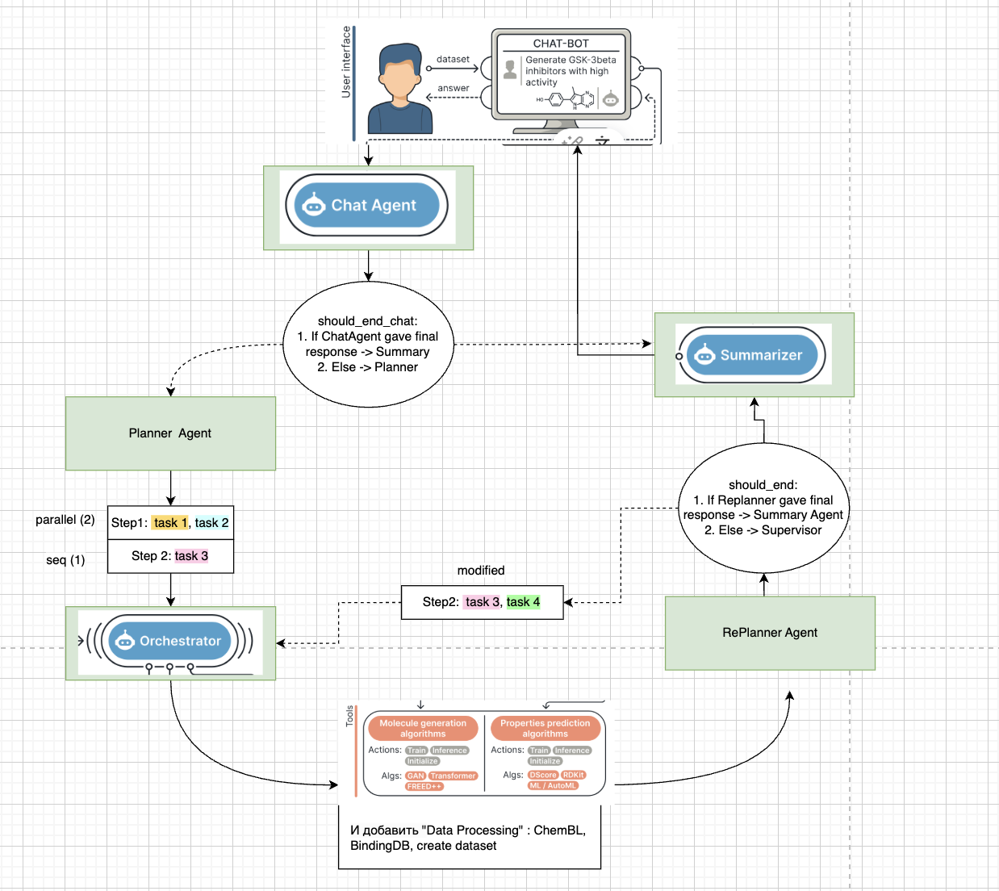

# MADD

## Query Examples

### 🧪 Start communication with
```python
"What can you do?"
```
### 🧪Dataset preparation
```python
"Download data from ChemBL with KRAS protein and IC50 values."
"Download data from BindingDB with KRAS protein and IC50."
"Download data from DB_NAME with PROTEIN_NAME and PROPERTY."
```
### 🧪Molecule generation
```python
"Generate GSK-3beta inhibitors with high activity"
"Generate molecules to inhibit the KRAS G12C protein mutation, focusing on selective binding and ensuring that HRAS and NRAS are not affected."
"Create compounds with electron-donating groups that can stabilize radical intermediates, reducing oxidative damage in neurons."
"Generate compounds with high affinity for sigma-1 receptors that may have neuroprotective effects in Parkinson's disease."
```
### 🧪Prediction
```python
"Predict IC50 for CN(C)CCOC(C1=CC=CC=C1)C1=CC=CC=C1 by 'IC50_predictor' model."
"Predict PAINS for CN(C)CCOC(C1=CC=CC=C1)C1=CC=CC=C1 by ml-model."
```

### 🧪AutoML/DL
```python
"What generative models are available now?"
"Run training model to predict IC50 on my attached data."
"Check the status of the training for the 'IC50_predictor'."
```
## Agent system diagram


### Environment Setup for Development
```commandline
git clone https://github.com/alinzh/MADD-CoScientist.git
cd MADD-CoScientist
pip install .
```

### Start MADD with GUI
Run in CLI:
```commandline
streamlit run MADD/streamlit_app.py
```

You should look something like thise:
```commandline
You can now view your Streamlit app in your browser.

Local URL: http://localhost:8501
Network URL: http://192.168.0.12:8501
```
Click on the URL, the link will open.


